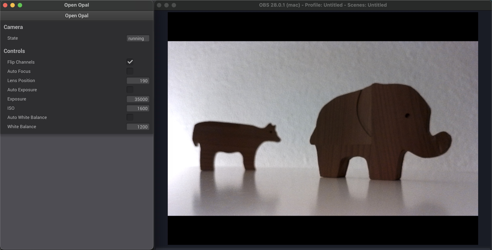

# Open Opal C1

Examples to control the [Opal C1](https://opalcamera.com/) from within python. This repository has been created because
Opal currently does not provide software control of the camera under Windows. Controlling the camera parameters is
crucial for computer vision applications like in robotics or exhibitions.

Since Opal C1 is based on the [LCM48](https://docs.luxonis.com/projects/hardware/en/latest/pages/articles/sensors/imx582.html) sensor, integrated
in the [Luxonis](https://www.luxonis.com/) hardware system, it is possible to use the camera as an [OAK-1
MAX](https://docs.luxonis.com/projects/hardware/en/latest/pages/NG9096max.html#ng9096max). To read the camera image and
control the camera parameters it is possible to use the [depthai](https://docs.luxonis.com/en/latest/) python framework.

### Open Opal App

As a quick demonstration, an app has been created that streams the Opal 4k stream into [OBS](https://obsproject.com/).
Just download the executable and run it. It currently is only possible to set the auto-focus and lens distance.



*Basic example that streams the Opal into OBS.*

A prebuilt binrary is available from the [releases](https://github.com/cansik/open-opal-c1/releases/tag/v0.1.0).

#### Build

To build the app yourself, please [install](#Installation) the dependencies and use the following command.

```
python setup.py distribute
```

### Installation

It is recommended to use a modern python version like `3.10` and creating
a [virtual environment](https://docs.python.org/3/library/venv.html). To install all the dependencies, run the following
command.

```bash
pip install -r requirements.txt
```

### Demos

Many of the demos showed here are following directly the depthai python demos. Usually only the resolution and some
camera specific parameters have been adapted.

#### Preview Demo

This demo just opens an opencv window and displays the 4k stream.

```
python demos/preview-demo.py
```

### About

Developed by cansik 2023
